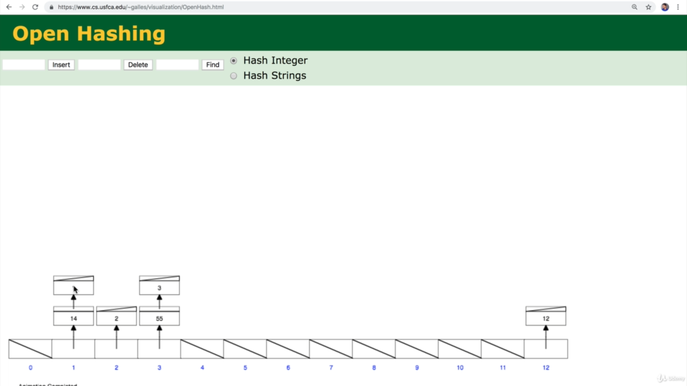
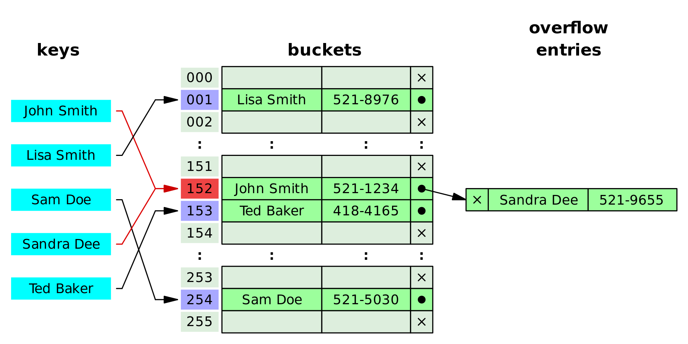
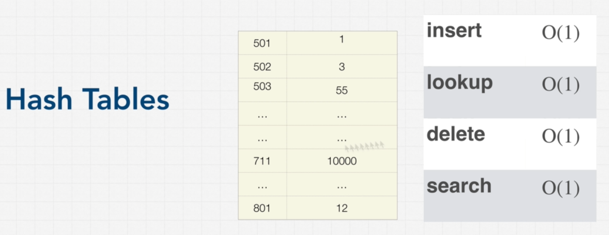

# Hash Tables

## What is Hash Table?

In computing, a hash table (hash map) is a data structure that implements an associative array abstract data type, a structure that can map keys to values. A hash table uses a hash function to compute an index, also called a hash code, into an array of buckets or slots, from which the desired value can be found.

Every programming language has there own Hash Table. In **JavaScript**, it's **Object**. In **Python**, it's a **Dictionary**.

## What is a Hash Function?

A hash function simply generates a hashed number for a given value which then turned into a memory address. As a result, we can store the values in a particular address and can retrive them from that address using the hash function.
You can visit [miraclesalad](http://www.miraclesalad.com/webtools/md5.php) to get a taste of the hashed values.

## What is Hash Collisions?

Ideally, the hash function will assign each key to a unique bucket, but most hash table designs employ an imperfect hash function, which might cause hash collisions where the hash function generates the same index for more than one key. Such collisions are always accommodated in some way.

Theoretically, when a collision happened, it slows down reading and writing with a hash table in O(n/k) or O(n), where k is the size of the hash table.

You can play with the hash table in [OpenHash](https://www.cs.usfca.edu/~galles/visualization/OpenHash.html). Try inserting 1, 3 and 55. We'll notice there is a same address for both 3 and 55.

Though it's solved by the programming languages using different methods such as linked list. Visit [Wikipides](https://www.cs.usfca.edu/~galles/visualization/OpenHash.html) to more about hash tables.

## Time Complexity

In many situations, hash tables turn out to be on average more efficient than search trees or any other table lookup structure. For this reason, they are widely used in many kinds of computer software, particularly for associative arrays, database indexing, caches, and sets.

### Pros

1. Fast lookups (Good Collision resolution needed or lookup can go upto O(n)).
2. Fast inserts.
3. Flexible keys.
4. With hash tables, we can optimize the nested loops to have O(n) time complexity. (Most Important)

### Cons

1. Unordered.
2. Slow key iteration.

## Hash Tables in JavaScript (Object vs Map vs Set)

In "Object", we can only use **String** as key and doesn't maintain Order in terms of storing the data in memory.

But in "Map", we can use any types of **Datatype** as key and data is stored in Order.

"Set" is another type of hash table in JS which is similar to map but only store the Key.
