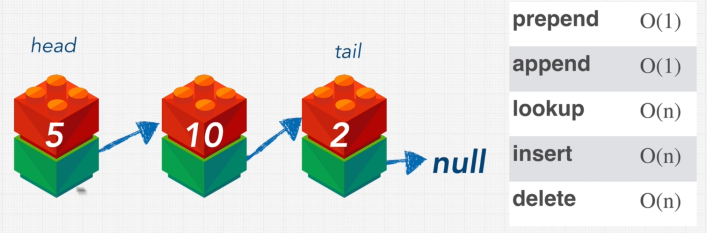

# Linked List

## What is a linked list?

A set of nodes which has two elements: value and address pointer. First node refers to Head and Last node refers to Tail which has a null address pointer.
JavaScript doesn't come with built-in linked list whereas Java does.
We can play with the linked list in [Visualgo](https://visualgo.net/en/list).

## What is a Pointer?

In computer science, a pointer is a programming language object that stores the memory address of another value located in computer memory. A pointer references a location in memory, and obtaining the value stored at that location is known as dereferencing the pointer.

