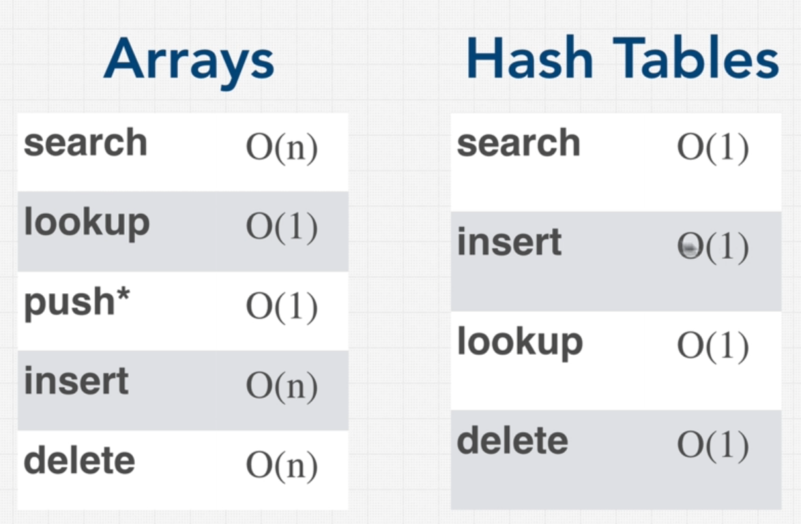

### Data Structures

## Array vs Hash Table

Hash tables are great when we want immediate access to certain values. Searching through an array for an item takes O(n) time whereas hash tables take only O(1). That's why Hash tables are used in databases for faster search.

Insert takes only O(1) in case of hash tables regardless of collitions as good hash function can minimize it significantly. Whereas arrays need O(n).

Hash table has the disadvantage of not having oreder index whereas Arrays got a ordered indecis.

